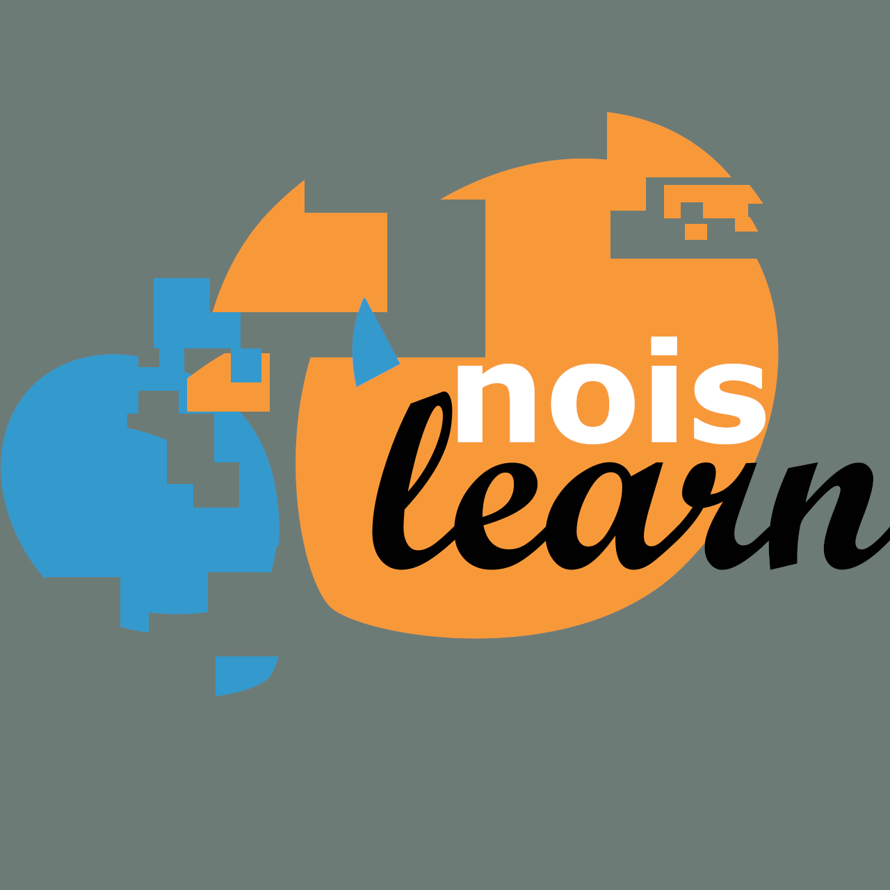

---
hide:
  - toc
---

# noislearn

  

`noislearn` is an scikit-learn compatible toolkit for label-noise filtering, iterative cleaning, and explainable inspection of noisy decisions.

  Distance-based filters
  Classifier-based filters
  TabPFN explanations
  CNC-NOS cleaner

[Getting started](guide/getting-started.md){ .md-button .md-button--primary }
[API reference](api/index.md){ .md-button }

-   :material-filter: __Filters__

    ---

    Classical, distance-based, ensemble-based, and TabPFN-based noise filters.

    [Browse the filters](api/filters/distance-based.md)

-   :material-broom: __Cleaners__

    ---

    Higher-level cleaning pipelines built on top of the available filters.

    [Open the cleaners API](api/cleaners.md)

-   :material-book-open-page-variant: __Concepts__

    ---

    Short guides on noise models, filtering strategies, and local explanations.

    [Read the guides](guide/noise-models.md)

-   :material-chart-box-outline: __TabPFN explainability__

    ---

    Local SHAP-based reports for noisy-instance inspection and auditability.

    [Explore the explanation model](guide/tabpfn-explainability.md)

!!! note
    The API pages are generated from the public docstrings in the source tree.
